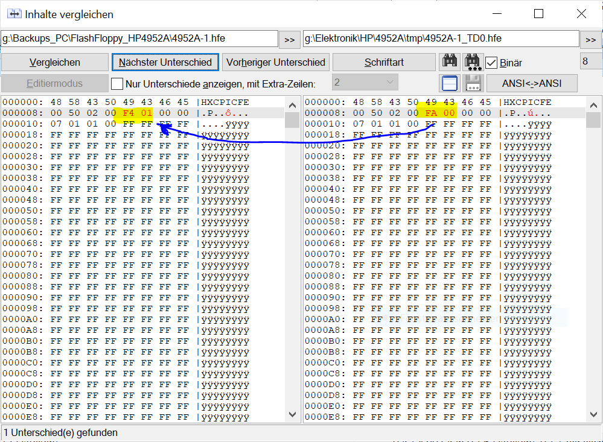

# hp4952disks

There are several images of HP4952A disks. CuriousMarc has some disks made available in ImageDisk format, which contains every required information to rebuild disks.
See [https://www.curiousmarc.com/instruments/hp-4957a-protocol-analyzer](https://www.curiousmarc.com/instruments/hp-4957a-protocol-analyzer) for details.
Another source is [https://github.com/hughpyle/HP4952A/tree/master/disks](https://github.com/hughpyle/HP4952A/tree/master/disks) with disk images in TeleDisk format.

## Using a Gotek floppy emulator

The original disk drive is somewhat special, it is a 720kB drive that spins at 600rpm instead of normal PC drives spinning at 300rpm.
Emulating such a drive is possible with a Gotek hardware and FlashFloppy firmware. See [https://github.com/keirf/flashfloppy](https://github.com/keirf/flashfloppy) for details. 
Be warned that I only was able to use one of the old Gotek drives with an STM32 processor, the cheap current ones using an AT32 processor lack some IO pins. Goteks with an AT32F435 **should** work...

The HP uses some kind of protection against copying his disks, including garbled address marks and weird track layouts. 
I had to repair my instrument and documented my findings. I disassembled parts of the disk processor code. 

1. Download HxCFloppyEmulator_soft.zip from HXC2001.COM
2. Flash the Gotek with FlashFloppy, I used version 3.35. 
3. Modify a cable to connect the Gotek to the HP4952A and connect it. Double check your work.
4. Format an USB stick and put FF.CFG, IMAGE_A.CFG and Empty_Disc_4952A.hfe to the stick.
5. Power on the HP4952A and "format" the HFE file. Unplug the USB stick and copy the hfe file back to your computer.
6. Convert 4952A-1.TD0 and 4952A-2.TD0 to HFE format. The resulting files should have 2.008.064 bytes. Patch two bytes according to  from FA 00 to F4 01. Copy them to your USB stick and test them.
7. Convert disk images in IMD format to HFE format. Note that these files are slightly shorter as they lack the upper tracks. Patch the two bytes for the data rate.
8. Use hfecat.py with the shorter HFE images: `python3 hfecat.py file.IMD.hfe Empty_Disc_4952A.hfe fixed_file.IMD.hfe`
9. Copy the converted HFE files to your USB drive and test them in your instrument.

